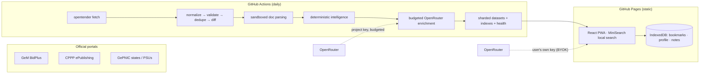

# OpenTender India

**An open procurement intelligence layer for India.**
Search, understand and track Indian public procurement — from GeM, CPPP and
NIC eProcurement portals — with evidence-first AI assistance.

> OpenTender India is an independent open-source project and is not affiliated
> with the Government of India or any procurement authority.
> Always verify tender information on the linked official portal before making
> procurement decisions or submitting a bid.

[](./.github/workflows/ci.yml)
[License: AGPL-3.0](LICENSE) · Runs at **₹0/month** baseline infrastructure cost.

---

## What it does

- **One search across India** — a single query over multiple official
  procurement ecosystems: GeM BidPlus, CPPP ePublishing, NIC GePNIC state/PSU
  portals (see [source coverage](docs/source-research.md)).
- **Deterministic first, AI second** — dates, amounts (₹ lakh/crore), tender
  numbers, deduplication and change detection are parsed deterministically.
  AI is reserved for summarisation, eligibility extraction and risk analysis —
  always with citations into document evidence, `NOT_FOUND` when absent.
- **Corrigendum intelligence** — every tender behaves like a versioned record:
  field-level diffs, severity classification and change timelines.
- **Company matching on-device** — an optional local profile ranks "For You"
  opportunities with explainable scores. Nothing personal leaves your browser.
- **Works without AI** — search, filters, bookmarks, saved searches, calendar
  exports, CSV/JSON export and source-health transparency all function with AI
  disabled or unavailable.

## Architecture at a glance



Deep dive: [docs/architecture.md](docs/architecture.md) · decisions in
[docs/adr/](docs/adr/) · portal research in
[docs/source-research.md](docs/source-research.md).

## Repository layout

```text
apps/web            React + TS + Vite + Tailwind frontend (static)
packages/schema     Canonical tender JSON Schema (+ mirrors)
packages/ai         AI layer: provider router, budget, cache, queue, prompts
scrapers/core       Adapter framework, models, parsers, store, health
scrapers/adapters   GePNIC generic adapter, GeM adapter
scrapers/configs    Per-source YAML configuration
cli.py              `opentender` command-line interface
data/               Hot storage + generated indexes (committed by CI)
status/             Source health, AI budget, feeds
docs/               Research reports, architecture, ADRs
tests/              Fixture-driven parser tests + AI-layer tests
.github/workflows   fetch / reconcile / source-health / archive / ci / deploy
```

## Quick start

### Frontend

```bash
cd apps/web
npm install
npm run seed     # labelled synthetic fixtures for local dev (never shipped as real data)
npm run dev      # http://localhost:5173
```

Without a generated dataset the app shows clearly-marked fixture data with a
banner. Production datasets come from the ingestion pipeline.

### Ingestion pipeline

```bash
pip install -e ".[dev]"
opentender sources          # list registered sources + statuses
opentender health           # smoke-test every portal
opentender fetch --all      # polite crawl of permitted sources
opentender validate         # validate stored data against canonical schema
opentender build-index      # generate frontend datasets + digest
opentender stats
```

Optional AI enrichment (uses your key; never required):

```bash
export OPENROUTER_API_KEY=sk-or-...
export MAX_AI_REQUESTS_PER_DAY=40
opentender ai queue --reason new --limit 30
opentender ai run
```

### Tests

```bash
pytest tests/ -q                 # Python: parsers, adapters, storage, AI layer
cd apps/web && npm run typecheck # frontend types
npm run build                    # production build
ruff check scrapers packages cli.py tests
```

## Scraping ethics

We access only public surfaces, politely:

- descriptive User-Agent; per-host delays (3–6 s); single concurrent request;
- robots.txt respected — sources that disallow crawling ship **disabled by
  default** (`POLICY_RESTRICTED`) with explicit operator opt-in;
- CAPTCHA/login walls are never bypassed, solved or proxied around;
- runtime guard halts any deployment that presents an unexpected challenge;
- zero-result anomaly detection publishes degradation instead of silently
  overwriting good data.

See [docs/source-research.md](docs/source-research.md) for per-portal detail.

## Security & privacy

- The project's `OPENROUTER_API_KEY` lives only in GitHub Actions secrets or
  server env — never in frontend code or bundles (CI enforces this).
- Live AI Q&A uses **your own** OpenRouter key, stored locally in your browser.
- Three privacy modes gate what may be sent to AI providers; private notes are
  never uploaded.
- Tender documents are treated as hostile input (magic-byte validation,
  size/archive-bomb limits, no macro/formula execution).

Report vulnerabilities privately via
[GitHub security advisories](../../security/advisories). See [SECURITY.md](SECURITY.md).

## Contributing

PRs welcome — see [CONTRIBUTING.md](CONTRIBUTING.md). New data sources require
a verified reconnaissance report and ethics review first
([GOVERNANCE.md](GOVERNANCE.md)).

## License

[AGPL-3.0-or-later](LICENSE).
