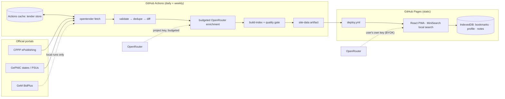

# OpenTender India

**An open procurement intelligence layer for India.**
Search, understand and track Indian public procurement — from GeM, CPPP and
NIC eProcurement portals — with evidence-first AI assistance.

> OpenTender India is an independent open-source project and is not affiliated
> with the Government of India or any procurement authority.
> Always verify tender information on the linked official portal before making
> procurement decisions or submitting a bid.

[](./.github/workflows/ci.yml)
[License: AGPL-3.0](LICENSE) · Runs at **₹0/month** baseline infrastructure cost.

**Live site:** <https://sdivyanshu90.github.io/opentender-india/> (GitHub Pages;
rebuilt after every daily ingestion).

## Coverage (as of 4 Oct 2026)

Hosted data comes from the seven GePNIC portals below, harvested through their
open "Tenders by Organisation" pages. Active tenders each portal advertised on
4 Oct 2026:

| Portal | Advertised active tenders |
|---|---|
| CPPP ePublishing | 1,382 |
| Rajasthan | 4,832 |
| Kerala | 7,525 |
| Madhya Pradesh | 5,320 |
| Uttarakhand | 725 |
| Jammu & Kashmir | 4,767 |
| BEL | 100 |
| **Total** | **24,651** |

The daily run visits the 60 largest organisations per portal, which covers
roughly 97% of those advertised tenders; the weekly reconcile walks every
organisation. These are the portals' own counts, not a guarantee of what the
site holds at any moment, and the site is not a complete view of Indian
procurement. See [limitations](#known-limitations) and
[docs/source-research.md](docs/source-research.md).

---

## What it does

- **One search across official portals** — a single query over CPPP
  ePublishing and NIC GePNIC state/PSU portals in the hosted dataset; a GeM
  adapter exists but does not currently feed it (see
  [limitations](#known-limitations) and [source coverage](docs/source-research.md)).
- **Deterministic first, AI second** — dates, amounts (₹ lakh/crore), tender
  numbers, deduplication and change detection are parsed deterministically.
  AI is reserved for summarisation, eligibility extraction and risk analysis —
  always with citations into document evidence, `NOT_FOUND` when absent.
- **Corrigendum intelligence** — every tender behaves like a versioned record:
  field-level diffs, severity classification and change timelines.
- **Company matching on-device** — an optional local profile ranks "For You"
  opportunities with explainable scores. Nothing personal leaves your browser.
- **Works without AI** — search, filters, bookmarks, saved searches, calendar
  exports, CSV/JSON export and source-health transparency all function with AI
  disabled or unavailable.

## Architecture at a glance


```mermaid
flowchart LR
  subgraph Portals["Official portals"]
    GEM[GeM BidPlus]
    CPPP[CPPP ePublishing]
    ST[GePNIC states / PSUs]
  end
  subgraph Actions["GitHub Actions (daily + weekly)"]
    FETCH[opentender fetch] --> NORM[validate → dedupe → diff]
    NORM --> AI[budgeted OpenRouter enrichment]
    AI --> IDX[build-index + quality gate]
    CACHE[(Actions cache: tender store)] <--> FETCH
    IDX --> ART[site-data artifact]
  end
  subgraph Pages["GitHub Pages (static)"]
    ART --> DEPLOY[deploy.yml] --> WEB[React PWA · MiniSearch local search]
    WEB --> IDB[(IndexedDB: bookmarks · profile · notes)]
  end
  CPPP --> FETCH
  ST --> FETCH
  GEM -.local runs only.-> FETCH
  OR[OpenRouter] -.project key, budgeted.-> AI
  OR2[OpenRouter] -.user's own key (BYOK).-> WEB
```

Deep dive: [docs/architecture.md](docs/architecture.md) · decisions in
[docs/adr/](docs/adr/) · portal research in
[docs/source-research.md](docs/source-research.md).

## Repository layout

```text
apps/web            React + TS + Vite + Tailwind frontend (static)
packages/schema     Canonical tender JSON Schema (+ mirrors)
packages/ai         AI layer: provider router, budget, cache, queue, prompts
scrapers/core       Adapter framework, models, parsers, store, health
scrapers/adapters   GePNIC generic adapter, GeM adapter
scrapers/configs    Per-source YAML configuration
cli.py              `opentender` command-line interface
data/               Local tender store + generated indexes (git-ignored; see Storage model)
archive/            Immutable monthly partitions of long-closed tenders (committed)
status/             Source health, AI budget, feeds (committed)
docs/               Research reports, architecture, ADRs
tests/              Fixture-driven parser tests + AI-layer tests
.github/workflows   fetch / reconcile / source-health / archive / ci / deploy
```

## Quick start

### Frontend

```bash
cd apps/web
npm install
npm run seed     # labelled synthetic fixtures for local dev (never shipped as real data)
npm run dev      # http://localhost:5173
```

Without a generated dataset the app shows clearly-marked fixture data with a
banner. Production datasets come from the ingestion pipeline.

### Ingestion pipeline

```bash
pip install -e ".[dev]"
opentender sources          # list registered sources + statuses
opentender health           # smoke-test every portal
opentender fetch --all      # polite crawl of permitted sources
opentender validate         # validate stored data against canonical schema
opentender dedupe           # cross-source possible-duplicate groups
opentender build-index      # generate frontend datasets + digest
opentender stats
```

`opentender fetch --all` walks GePNIC portals through their "Tenders by
Organisation" pages: largest organisations first, capped at `max_orgs` (60)
per portal. Set `OPEN_TENDER_MAX_ORGS` to override the cap, for example
`OPEN_TENDER_MAX_ORGS=100000` to walk every organisation (what the weekly
reconcile does). A single source: `opentender fetch gepnic_kerala`. Exit codes:
`0` ok, `2` no source given, `3` nothing was fetched from any source.

`opentender build-index` writes `data/indexes/search-docs.json.gz` and its
`.meta.json`. Options:

| Option | Default | Effect |
|---|---|---|
| `--retention-days` | 30 | drop tenders that closed more than N days ago from the browser index (they stay in the store/archive) |
| `--max-drop` | 0.5 | quality gate: refuse to publish if the index shrinks by more than this fraction versus the previous build |
| `--force` | off | publish even if the gate fails |

The gate also refuses an empty index. On failure it exits with code `4` and
leaves the previously published index untouched.

Optional AI enrichment (uses your key; never required):

```bash
export OPENROUTER_API_KEY=sk-or-...
export MAX_AI_REQUESTS_PER_DAY=40
opentender ai queue --reason new --limit 30
opentender ai run
```

### Tests

```bash
pytest tests/ -q                 # Python: parsers, adapters, storage, AI layer
cd apps/web && npm run typecheck # frontend types
npm run build                    # production build
ruff check scrapers packages cli.py tests
```

## Storage model

- **Not committed:** `data/hot/` (per-tender gzip JSON), `data/state.json`,
  `data/index/` and `data/indexes/` are git-ignored. Rewriting ~25k records
  daily would bloat history and bury real changes in noise commits
  ([ADR-005](docs/adr/ADR-005.md)).
- **Committed:** `status/` (source health, feeds) and `data/ai-queue.jsonl` and
  `archive/`, immutable `source_YYYY_MM.json.gz` partitions that
  `opentender archive` writes monthly for tenders closed more than 180 days.
- **Between runs:** the store lives in the GitHub Actions cache
  (`tender-store-*`). Each run re-walks all active tenders, so an evicted
  cache loses revision history, not current data.

## CI topology

| Workflow | Trigger | Role |
|---|---|---|
| `fetch-tenders` | daily 02:17 IST, manual | restore store from cache, `fetch --all`, validate, dedupe, AI (budgeted), `build-index`, tests; saves the store to the cache and uploads the `site-data` artifact; commits `status/` only |
| `weekly-reconcile` | Sundays | calls `fetch-tenders` via `workflow_call` with a full organisation walk |
| `deploy` | push to `main`, after `fetch-tenders`/`weekly-reconcile` succeed, manual | builds the frontend with `BASE_PATH=/opentender-india/`, downloads the latest `site-data` artifact, publishes to Pages (`404.html` is the SPA fallback for deep links) |
| `source-health` | every 6 h | portal smoke tests, writes `status/sources.json` |
| `archive` | monthly | compacts old closed tenders into `archive/` partitions |
| `ci` | push to `main`, PRs | pytest, lint, frontend tests, typecheck, build |
| `e2e` | manual, weekly (Fri) | Playwright journeys against fixture data |

`fetch-tenders`, `source-health` and `archive` share the `data-commit`
concurrency group so only one writes the store or pushes to `main` at a time.
`deploy` runs in its own `pages` group.

## Known limitations

- **GeM is not in the hosted data.** GeM coverage comes from the public BidPlus
  listing (about 45,000 ongoing bids on 4 Oct 2026). Each run takes up to 50
  pages (~500 bids) newest-first at ≥3.5 s per request, so older bids are not
  backfilled; every record links to the public bid PDF. MSE/startup/Make-in-India
  flags are not exposed publicly and are not captured. GeM refuses connections
  from datacentre IPs, including GitHub-hosted runners: run this source from an
  Indian network (e.g. a free self-hosted runner) — the adapter reports
  "blocked from this network" instead of hanging.
- **GePNIC listings behind CAPTCHA are skipped, never bypassed.** On 4 Oct 2026
  "Latest Active Tenders" and "Tenders by Closing Date" were CAPTCHA-gated on all
  seven configured portals, hence the organisation walk.
- **Not ingested:** IREPS (its search is disallowed by robots.txt) and
  MahaTenders (robots.txt disallows all crawling; `POLICY_RESTRICTED`, opt-in
  by environment variable only).
- Per-run detail-page hydration is capped (`max_detail_per_run`), so some
  records carry listing-level fields only.

## Scraping ethics

We access only public surfaces, politely:

- descriptive User-Agent; per-host delays (3–6 s); single concurrent request;
- robots.txt respected — sources that disallow crawling ship **disabled by
  default** (`POLICY_RESTRICTED`) with explicit operator opt-in;
- CAPTCHA/login walls are never bypassed, solved or proxied around;
- runtime guard halts any deployment that presents an unexpected challenge;
- zero-result anomaly detection publishes degradation instead of silently
  overwriting good data.

See [docs/source-research.md](docs/source-research.md) for per-portal detail.

## Security & privacy

- The project's `OPENROUTER_API_KEY` lives only in GitHub Actions secrets or
  server env — never in frontend code or bundles (CI enforces this).
- Live AI Q&A uses **your own** OpenRouter key, stored locally in your browser.
- Three privacy modes gate what may be sent to AI providers; private notes are
  never uploaded.
- Tender documents are treated as hostile input (magic-byte validation,
  size/archive-bomb limits, no macro/formula execution).

Report vulnerabilities privately via
[GitHub security advisories](../../security/advisories). See [SECURITY.md](SECURITY.md).

## Contributing

PRs welcome — see [CONTRIBUTING.md](CONTRIBUTING.md). New data sources require
a verified reconnaissance report and ethics review first
([GOVERNANCE.md](GOVERNANCE.md)).

## License

[AGPL-3.0-or-later](LICENSE).
